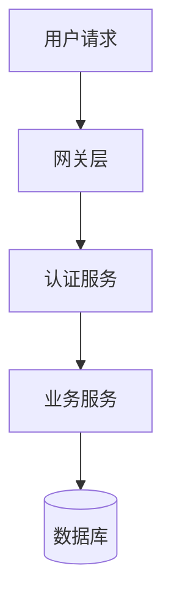

# 技术博客写作规范

本文档为有来开源项目（[vue3-element-admin](https://gitee.com/youlaiorg/vue3-element-admin)、[youlai-boot](https://gitee.com/youlaiorg/youlai-boot) 等）配套文档，统一技术博客的写作风格。

## 核心原则

借鉴 [技术博客写作最佳实践](https://mukulkadel.com/writing-technical-blog-posts-that-help/)：

- **一篇文章只讲一件事**：试图覆盖"Docker 网络、卷、多阶段构建"的文章什么都教不好。一篇只讲"容器间为什么不能通信，怎么用 bridge 网络修复"的文章才有深度。动笔前完成这句话："读完本文，读者能 _____"
- **先讲问题，再讲方案**：不要一上来就给解决方案。先描述具体问题（"查询要 12 秒，用户在等"），让读者判断是否与自己相关
- **先讲为什么，再讲怎么做**：给命令的同时解释为什么这样做。测试：读完之后，读者能否在略微不同的场景中做出合理决策？不能就说明只教了"怎么做"没教"为什么"
- **代码必须可运行**：完整 import、无占位符、真实数据、展示输出。读者复制跑不通，信任就断了
- **为带着问题的读者写**：技术读者是来解决问题的，不是来读教材的。把答案前置，再给解释

## 开头结构编排规则

### 一条铁律

**标题（`#`）与 `## 前言` 之间禁止放任何游离内容。** 摘要、指标表、截图都是前言的组成部分，必须收进 `## 前言` 内部，由引导语引出。

### 摘要的归属

摘要是发布平台的元数据，不是正文。

- **发布时**：复制到平台摘要字段，不进正文渲染
- **文档中**：用 HTML 注释保留在标题下方，方便复用

```markdown
# 文章标题

<!-- 摘要（发布时填到平台摘要区，不进正文）：
[80-120 字纯文本摘要]
-->

## 前言
```

### 前言内部结构

前言按以下顺序组织，各部分用自然过渡衔接：

| 顺序 | 内容 | 作用 |
|------|------|------|
| 1 | 引导语（1-2 句） | 一句话说清"这是什么" |
| 2 | 效果前置（表格 / 截图 / PK 图） | 3 秒展示"跑起来长什么样" |
| 3 | 痛点叙事（2-3 段） | 共鸣："我也遇到过" |
| 4 | 本文看点（清单） | 告诉读者能收获什么 |
| 5 | 体验入口（在线体验 + 账号） | 想试的读者直接进去 |

### 完整开头模板

```markdown
# 文章标题

<!-- 摘要（发布时填到平台摘要区，不进正文）：
[80-120 字纯文本，背景痛点 + 本文方案 + 核心价值]
-->

## 前言

[一句话项目/方案介绍，引出下面的指标和截图]

| 指标 | 数值 |
|------|------|
| ... | ... |

| 截图 A | 截图 B |
|:------:|:------:|
|  |  |

---

[痛点叙事：2-3 段，每段 3-4 句]

[本文方案一句话过渡]

**本文看点：**

- [x] **[看点1]**：[一句话说明]
- [x] **[看点2]**：[一句话说明]

**在线体验**：[链接]（PC） · [链接]（移动端）　**账号**：`admin` / `123456`

---

## 一、正文...
```

### 常见错误

| 错误 | 修正 |
|------|------|
| 标题下直接放指标表 | 表格移入前言，前面加引导语 |
| 摘要写进正文渲染 | 用 HTML 注释保留，发布时填平台摘要区 |
| 前言列源码 + 文末又列一遍 | 源码统一放文末"项目入口" |
| 指标表含协议，前言又写协议 | 前言不重复指标表已有信息 |

---

## 标题规范

### 主标题 SEO

**公式**：`技术栈/框架 + 核心功能 + 场景/价值 + 项目名（可选）`

**关键词分级**：

| 级别 | 类型 | 示例 | 建议位置 |
|------|------|------|----------|
| 高频 | 框架名 / 语言名 | Spring Boot、Java、Vue3 | 主标题必含，至少 1 个 H2 |
| 中频 | 功能词 / 概念词 | RBAC、权限管理、多租户、JWT | 主标题或 H2 |
| 长尾 | 场景词 / 痛点词 | SaaS 从 0 到 1、行级隔离、双会话 | H2 / H3 |

> **H2 是 SEO 权重最高的位置**。每个二级标题至少包含一个中高频搜索词。

### 章节标题层级

| 层级 | 格式 | 示例 |
|------|------|------|
| 一级 `#` | 仅一个，文章主标题 | `# 文章标题` |
| 二级 `##` | 主要章节，用"一、二、三、" | `## 一、模式选择` |
| 三级 `###` | 子章节，用"1.1、1.2、" | `### 1.1 三种模式` |
| 超过三级 | 用粗体代替 | `**核心优势：**` |

---

## 摘要规范

- **字数**：80-120 字，3-5 句
- **格式**：纯文本，禁止 Markdown 语法
- **内容**：问题背景 + 解决方案 + 核心价值

**模板**：`[背景/痛点] + [本文方案] + [核心价值/适用场景]`

---

## 正文规范

### 正确展示错误做法

展示错误做法 alongside 正确做法，解释为什么错，比只给正确答案理解更深：

```typescript
// 错误：f-string 直接拼接，SQL 注入风险
cursor.execute(f"SELECT * FROM users WHERE id = {user_id}")

// 正确：参数化查询，驱动安全替换
cursor.execute("SELECT * FROM users WHERE id = %s", (user_id,))
```

### 非显而易见的部分

正文除了"快乐路径"，必须有"非显而易见的部分"——这是好文章和普通文章的分水岭：

- 什么时候这个方案不适用
- 看起来等价但实际有坑的替代写法
- 边界条件、性能陷阱、兼容性问题

> 能展示 happy path 的人很多，能讲清"什么时候会坏"的人很少。后者才会被收藏。

### 代码块规范

- 必须指定语言，否则无法语法高亮
- 代码必须可独立运行：完整 import、无 `// ...` 占位、无 `pass`、用真实数据（`user_id = 42` 不写 `<your id here>`）
- 展示输出：让读者知道"跑通了"长什么样

```bash
$ git log --oneline -5
3a9f2e1 fix(auth): handle null session on logout
b7c4d83 feat(api): add pagination to /users endpoint
```

### 图表规范

优先使用 Mermaid 语法（CSDN 原生支持）：



### 代码注释规范

注释写"为什么"和踩坑点，不写代码已经在说的。

```typescript
// 单例模式防止并发刷新
let refreshPromise: Promise<void> | null = null;

function refreshTokenOnce() {
  // 已有刷新进行中，复用 Promise
  if (refreshPromise) return refreshPromise;
  refreshPromise = refreshToken().finally(() => {
    refreshPromise = null;
  });
  return refreshPromise;
}
```

```typescript
// ❌ 复述代码：filter 已经说明了一切
/** 过滤出启用的项 */
const enabled = list.filter(item => item.status === 1);

// ✅ 写"为什么"
// status=1 是启用，数据库默认值是 0（禁用）
const enabled = list.filter(item => item.status === 1);
```

### 引用块规范

```markdown
> 注意：SQL 文件内部必须包含 `USE 数据库名;` 语句。
```

### 段落规范

**扫读原则：每段不超过 3-4 句，一段一个要点。**

- 一段只讲一个观点，多个要点拆成多段
- 段落之间留空行，给读者"呼吸感"

### 避免填充

以下填充形式一律删除——删掉后读者不会觉得缺了什么：

| 填充形式 | 示例 |
|---------|------|
| 冗长铺垫 | 开头绕半天才到重点 |
| 换词复述 | 用不同的话再说一遍刚才说的 |
| "本节将覆盖"前言 | `## 本节将介绍...` 然后才开始内容 |
| 复述式总结 | 结语把每个标题再列一遍，而非提炼洞察 |

> 一句话能说清的不写两句。一个标题下只有一段话，说明不需要这个标题。

---

## 结语规范

1. **总结价值**：一句话概括方案优势
2. **展望扩展**：可选的后续优化方向
3. **结尾话术**：共情式，避免程式化

```markdown
## 总结

通过 [技术方案]，实现了 [核心价值]。该方案具备：

- [特性1]：[一句话说明]
- [特性2]：[一句话说明]

**后续可扩展：**
- [扩展方向1]

---

**相关开源项目：**

| 项目 | 简介 | 源码 |
|------|------|------|
| [项目名] | [简介] | [链接] |

**在线体验**：[体验地址]

希望本文能为你的技术选型提供参考。如有不同见解，欢迎讨论。
```

---

## 图片与链接规范

### 图片存放与引用

就近原则：每个主题建一个与文档同名的目录，文档 `<文档名>.md`、图片清单 `README.md`、截图目录 `images/` 三者平级：

```
docs/
├── youlai-boot/
│   ├── minio-setup/
│   │   ├── minio-setup.md
│   │   ├── README.md
│   │   └── images/
│   │       └── minio-console-overview.png
```

**引用格式**：``

**要求**：
- 图片需有 alt 文本
- 文件名用小写英文 + 连字符（`swagger-ui-dropdown.png`）
- 同一主题的图片放在该主题目录下的 `images/`，不集中到 `docs/images/`

### 链接规范

```markdown
项目源码：[youlai-boot](https://gitee.com/youlaiorg/youlai-boot)
```

外部链接需标注来源：`- [MySQL 官方文档](https://dev.mysql.com/doc/)`

---

## 语气与风格：写出人味

博客不是技术文档的搬运，是**作者和读者之间的对话**。读者想看的是一个活人踩过的坑、积累的判断。

**三个关键词：说人话、有态度、带体温。**

### 反模式：AI 味重灾区

| 反模式 | 示例 | 问题 |
|--------|------|------|
| 排比式总结 | "本文首先分析了...，其次探讨了...，最后总结了..." | 像论文摘要，不像博客 |
| 万能过渡句 | "值得注意的是""需要指出的是" | 废话占位，删掉不影响语义 |
| 假装客观 | "众所周知""毋庸置疑" | 强行权威感，读者不买账 |
| 过度敬语 | "希望本文对您有所帮助" | 每篇都一样，毫无记忆点 |
| 模板式收尾 | "综上所述，该方案具有良好的扩展性" | 空话套话，不如不写 |
| 全面但平庸 | 每个点都展开，没有取舍 | 不敢遗漏 = 没有重点 = 没有观点 |

### 写法对照

```markdown
<!-- 不推荐：AI 味：模板套话 -->
在当今快速发展的软件开发领域，代码规范的重要性日益凸显...

<!-- 推荐：人味：从真实痛点切入 -->
改了一晚上别人的代码，发现 18 个原子类堆在一个元素上——这谁受得了？
```

```markdown
<!-- 不推荐：AI 味：端水大师 -->
方案 A 和方案 B 各有优劣，开发者可以根据实际需求选择。

<!-- 推荐：人味：亮出判断 -->
我选方案 A，理由很简单：90% 的 SaaS 第一阶段根本不需要独立数据库。
```

### 用词精准度

越靠近结论和原则，越泛指；越靠近故事和证据，越特指。

| 场景 | 用泛指还是特指 | 示例 |
|------|--------------|------|
| 表达通用原则 | 泛指 | "不靠文档"优于"不靠 wiki" |
| 讲踩坑故事 | 特指 | "规范写在 Confluence 上，链接发群里没人点" |
| 技术方案对比 | 特指 | "用 Redis 而不是 Memcached" |
| 归纳总结结论 | 泛指 | "靠结构约束，不靠文档自觉" |

### 读者画像决定语气密度

| 读者画像 | 关注点 | 语气策略 |
|---------|--------|---------|
| 架构师 / 技术负责人 | 权衡、边界、长期可维护性 | 多讲选型理由和 trade-off |
| 中高级开发 | 实现细节、踩坑经验 | 多讲代码和踩坑 |
| 初级开发 / 学习者 | 能不能跑通、怎么用 | 多讲步骤，配完整代码 |
| 决策者 / 产品经理 | ROI、成本、风险 | 先放量化收益，代码放最后 |

### 语气自检清单

- [ ] 删掉哪些段落，读者也不会觉得缺了什么？→ 那就删
- [ ] 有没有哪句话，任何一篇技术文章都能用？→ 换成自己的判断
- [ ] 读者看完能记住你的一句话吗？→ 如果不能，加一句有态度的总结
- [ ] 通读一遍，像不像在跟同事聊天？→ 不像就改

---

## 选题策略与传播机制

选题策略、爆火机制、叙事弧详见 [strategy.md](references/strategy.md)。

## 内容分发与数据迭代

内容复用（一鱼三吃）、文章长度、发布后数据复盘、发布检查清单详见 [distribution.md](references/distribution.md)。
